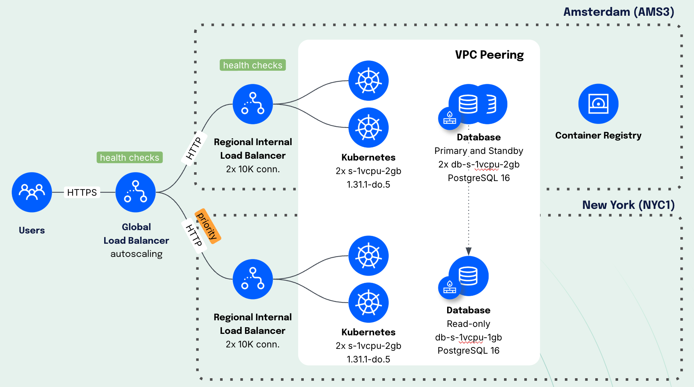

# The Invincible App
The Invincible App is a resilient cloud architecture distributed across DigitalOcean regions. It is designed with a Recovery Point Objective and Recovery Time Objective below 1 minute.

At the heart of the app is Node.js code deployed in Kubernetes clusters across two regions: Amsterdam and New York. The code accesses a PostgreSQL database with a primary and standby node in Amsterdam and a read-only node in New York.

## Architecture Diagram

When a user connects to the Invincible App, the request lands on a global load balancer configured to prioritize routing to New York. If New York is unavailable, the request is routed to Amsterdam.

The Node.js code for the Invincible App is universal for both locations, with database connection strings and credentials passed as environment variables.

## Failover Testing
When the New York database fails — an outage that takes the longest to detect — the failover to Amsterdam completes in approximately 20 seconds. When the database comes back online, the failover back to New York takes about 50 seconds. Failover times are directly influenced by the health check intervals and thresholds of global and regional load balancers, which are configurable.

## Questions?
[vprokopov@digitalocean.com](vprokopov@digitalocean.com)
